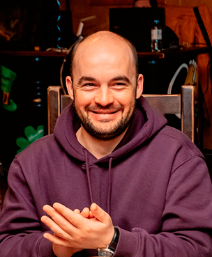

  

## Aleksej Shatov  

**Personal information**    
_Date of birth_: 25.10.1987    
_mobile_: 89206888826  
_e-mail_: shatov.aleksej@gmail.com  
_GitHub_: @Shatafaka  
_Discord (rs-scholl server)_: Shatov (@Shatafaka)  

**Objective**  
I am seeking employment with a company on front-end developer position.  
*Personal qualities*: analytical, attentive, disciplined, reliable.  

**Developer skills**  
Work on developer position (C++) for 1 year.  

**Code examples**  
```
function areYouPlayingBanjo(name) {
  return name + (name[0].toLowerCase() == 'r' ? ' plays' : ' does not play') + " banjo";
}
```

**Proffecional experience:**  
2009-2010: RusBitTech LLC, _position_: developer;  
2010-2016: Anti - aircraft missile division, _position_: engineer;  
2016 up to present: Military Academy of air soace defence, _position_: engineer.    

**EDUCATION**  
2004-2009: Military academy of air space defence, _faculty_: Automated control systems;  
2011-2014: Tver state technical university, _faculty_: Applied computer science in economics;    

**Languages**  
_russian_: native language;  
_english_: B1 level.  